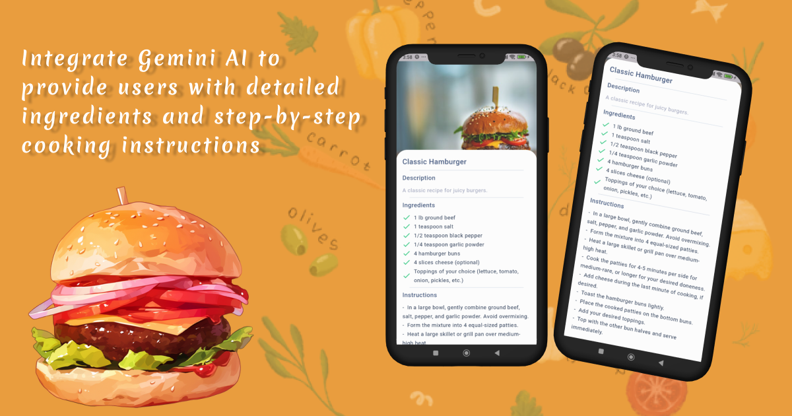
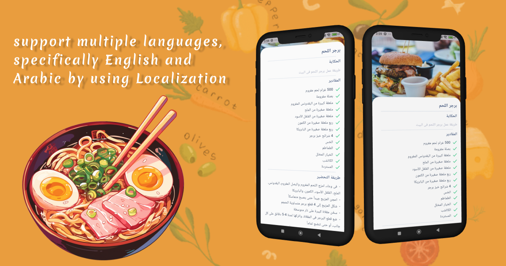

# Recipe Finder App

This project is built using **Flutter** and integrate the Gemini AI model and APIs to provide users with a seamless and interactive experience for discovering recipes.

## Key Features

### 1. **Gemini AI Integration**
   - **Gemini AI** offers up to **15 requests per minute (RPM)** and **1500 requests per day (RPD)**, making it stable and reliable for real-time interactions.
   - Unlike other AI models (e.g., **Qwen**), Gemini AI doesn't give the "model too busy" error, ensuring a smooth experience.
   - Responses from Gemini AI are in **JSON format**, which makes it easy to handle and integrate with Flutter/Dart.
   - The **Flutter/Dart support** in Gemini AI’s documentation makes it a perfect choice for this app.

### 2. **Localization (English & Arabic)**
   - To make the app accessible to a wider audience, the app supports **English** and **Arabic** localization.
   - The language switch allows users to easily toggle between the two, enhancing usability and inclusivity.

### 3. **Pexels API for Images**
   - The app uses the **Pexels API** to fetch high-quality images related to food recipes.
   - A challenge I encountered was handling **Arabic food names**, I used the **MyMemory API** to translate food names from Arabic to English before sending them to the Pexels API.

### 4. **State Management with Cubit**
   - I’ve implemented **Cubit** for state management, making the app scalable, clean, and maintainable.
   - The use of **Cubit** ensures a smooth user experience while keeping the codebase organized and modular.

### 5. **Clean Architecture**
   - The app follows the principles of **Clean Architecture** to maintain a scalable, testable, and maintainable codebase.
   - This pattern separates concerns and ensures that the application is structured in a way that is easy to update and manage over time.

### 6. **Security with env File**
   - API keys and other sensitive information are securely managed using an **env file**, ensuring that they are not exposed in the public codebase.
   - This method keeps secrets safe and secure while building the app.

### 7. **UI Enhancements**
   - To make the app more engaging, I’ve integrated **Lottie animations**, adding a delightful touch to the UI.
   - The app also uses the **Get_it** package for dependency injection, providing an easy way to manage app services.

## Images

