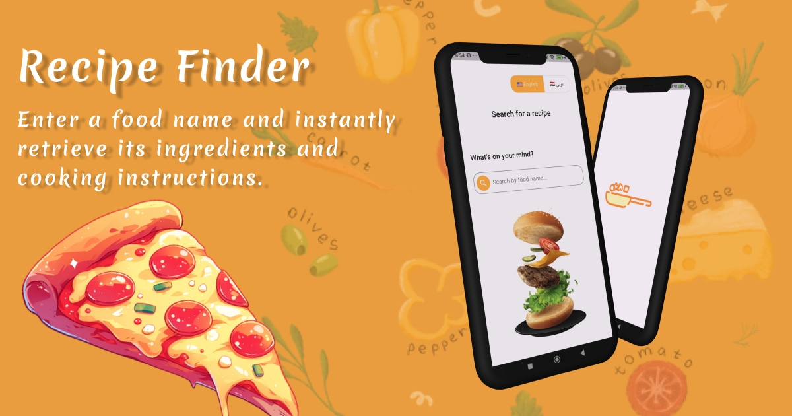

# Recipe Finder with Gemini AI Flutter

## Aim
Integrate Gemini AI to provide users with detailed ingredients and step-by-step cooking instructions

## Technology
I used Flutter technologye to provide this app in Android and IOS. 
- Cubit  
- Gemini AI  
- Localization (English & Arabic)  
- Clean architecture  
- Dio (API)  

## Language 
Dart

## UI Design
the design was given by Figma 

## Images

